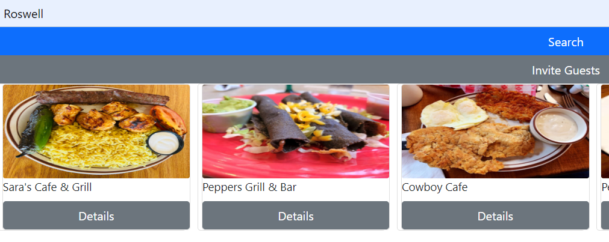

# Restaurant Tinder - An Outing Selector Application

Restaurant Tinder is a service made to facilitate group decisions about where to dine for a given outing. Coordinating dining preferences between a large group can be a daunting bid of frustration, but this service provides a designated user the ability to create an outing plan and invite guests to vote on their most-preferred venues.

The front end consists of a React.js application with Reactstrap for additional styling, while the back end utilizes the Java Spring Framework and PostgreSQL to handle user flow and data.

## Installation

Prior to running, set up the local database by either running `final-capstone/java/database/create.sh`, or by sequentially running the `.sql` files of the same directory as follows:
1. `dropdb.sql`
2. `schema.sql`
3. `user.sql`
4. `restaurant-data.sql`

To run the application:
1. Open the project directory in IntelliJ or similar IDE and start the back-end server by running `final-capstone/java/src/.../Application.java`.
2. Access the front-end application by navigating to `final-capstone/frontend/src` in terminal and running `npm install` followed by `npm start`.
3. The application should open at `http://localhost:3000/` in your browser. Once done with the application, ensure both processes above are safely terminated.

## Usage

1. As a new user, navigate to the log in screen, then click `Need an account?`.
   1. You will be redirected to create a new account.
   2. Provide a unique username and password, confirm your password, and `Register`.
2. Log in to your account using your new credentials.
   1. Logging in will produce an additional link to the `My Outings` page.
3. Local venues may be found by searching from the `Home` page.
   1. Enter either a city name or a ZIP Code into the search bar and press `Search`.
   2. Matching results will appear in the subsequent area as cards.
   3. Extra details for a given restuarant may be viewed by clicking on the card's `Details` button.
4. You may create a new outing based on a search result set to which you can invite guests.
   1. To invite guests to vote, click `Invite Guests` above the search results.
   2. A dialogue requesting event dates, times, and guest emails will display to be filled out.
   3. Clicking `Send Invitations` will create the outing in the database and send unique links to each email address for the guests to access.
   4. Guests may access their links without need of an account and view the list of restaurants.
      1. A guest can submit a vote for or against each option in the list.
      2. Votes must be placed before the deadline detailed by the host, after which the links are no longer accessible.
5. Navigate to the `My Outings` page to view your created outings.
   1. Outings with completed polls will grant access to the results, from which you may decide the final outing destination.

## Known issues
- Currently, only a limited selection of predefined restaurants is available to the database, those being in Roswell, NM. (ZIPs 88201 and 88203) The primary purpose of this project was to demonstrate overall functionality of a full-stack application, however this is something that could be addressed in the future.
- Functionality relating to emailing and accessing invitations has yet to be completed, due to the initial time constraints of the project. An update to this may soon follow.